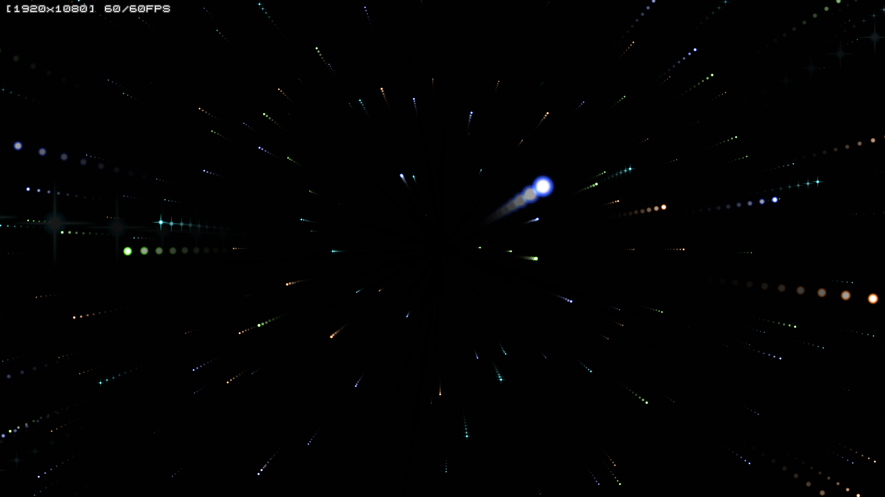

ssstarshsp
==========

Screensaver like ssstars.scr created by HGIMG3.

Table of Contents
-----------------

* [Description](#description)
* [Screenshots](#screenshots)
* [Environment](#environment)
* [Install](#install)
* [License](#license)
* [Author](#author)


Description
-----------

*  HSP + HGIMG3 で作成した、Windows用のスクリーンセーバです。
*  「宇宙飛行」スクリーンセーバと似た見た目になっています。
*  HGIMG3 を使ってスクリーンセーバを作れるのか実験した際の成果物です。
*  HSP に同梱されている sample\ssaver\arusave.hsp を fork して作成。

Screenshots
-----------



Environment
-----------

* Windows10 x64 22H2
* HSP 3.7 beta 7

Install
-------

以下の2つのファイルを所定の場所にコピーしてインストールします。

```
ssstarshsp.scr
ssstarshsp.ini
```

* 64bit版Windowsの場合、C:\Windows\SysWOW64\ 以下にコピー。
* 32bit版Windowsの場合、C:\Windows\System32\ 以下にコピー。

「スクリーンセーバの変更」画面で表示されるスクリーンセーバ名は、「starshsp」になるようです。Windows10 x64 22H2上では、「ss～.scr」というファイル名だった場合、最初の「ss」が省かれた形でスクリーンセーバの一覧上に表示されるようです。

改造したい場合は、src/ssstarshsp.hsp を弄ってください。

License
-------

元になった sample\ssaver\arusave.hsp のライセンスに従います。

Author
------

[mieki256](https://github.com/mieki256)


